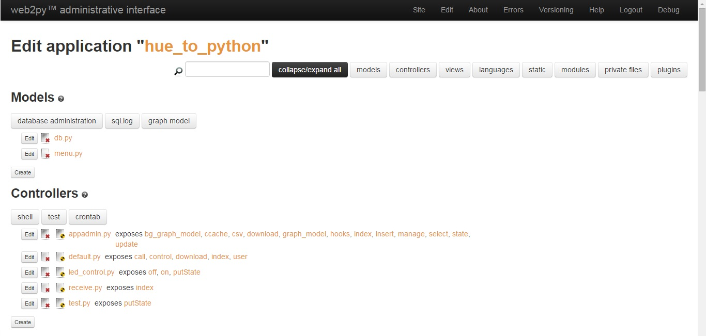

# web2py 설치

$sudo wget http://www.web2py.com/examples/static/web2py_src.zip

# web2py 실행

$sudo unzip web2py_src.zip  
cd web2py  
sudo python web2py.py

# pc에서 web2py admin page 접속하는 방법
web2py 디렉토리에서 실행하거나 web2py 디렉토리에 생성된 파일을 넣어준다.
  
새로운 인증서를 만들어준다.  
1. openssl genrsa -out server.key 2048  
2. openssl req -new -key server.key -out server.csr  

  
3. openssl x509 -req -days 365 -in server.csr -signkey server.key -out server.crt  
4. sudo python web2py -i (ip_address) -p 8000 -a 'password' -c server.crt -k server.key  

주소창에 입력한다.  
https:/ip_address:8000  

  
접속하면 application을 생성한다. 
application 생성후 edit화면에 들어가면 다음과 같은 화면이 나온다.  
  
controllers에 python 파일을 생성하여 원하는 함수를 정의해 준다.  

URL을 통해 해당 python의 함수를 콜할 수 있다.  

URL을 통해 함수를 콜하는 방법은 기존에 라즈베리파이에 직접 코딩하는 방식보다 훨씬 효율적으로 일처리를 할 수 있게 도와주었다.  
web상에서 파이선코드와 해당 타겟간의 실행 여부를 쉽게 알 수 있다는것과 라즈베리파이와 어플간의 따로 소켓통신이 필요없다는 점 공동 작업이 편하다는점, 새로운 기능에 대해서 기존방법보다 편하게 구현해 볼수 있다는 점이있다.

  

